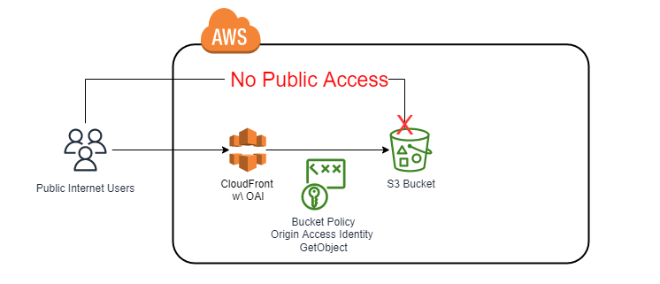

# CloudFront Origin Access Identities

This repo demonstrate how to securely deliver content to internet (public) using a (non-public) origin bucket.

## Overview

The repo is to demonstrate how to configure an AWS Cloudfront distribution with a private (non-public) bucket as the Origin Source.

## Motivation



### The following Resources will be created:

- CloudFront Distribution with Origin Access Identity (OAI)
- S3 Bucket with policy allowing GetObject action to OAI

## Pre-requisites

1. An AWS account with programmatic access to S3 and Cloudfront. The following managed policy are recommended.

   //todo: confirm least priv policies for repo

   1. AmazonS3FullAccess
   2. CloudFrontFullAccess
2. Terraform ([Installation Instructions](https://www.terraform.io/downloads.html))

   //todo: add terraform container for dev

## Installation

```bash
export AWS_ACCESS_KEY_ID=<your-aws-access-key-id>
export AWS_SECRET_ACCESS_KEY=<your-aws-secret-access-key>

terraform init
tarreform plan
terraform apply

aws s3 cp index.html s3://cloudfront-origin-private-bucket
```

- change name on bucket in s3.tf
- distribution cache invalidation automation isn't baked in, manual intervention required when updating S3 bucket objects
